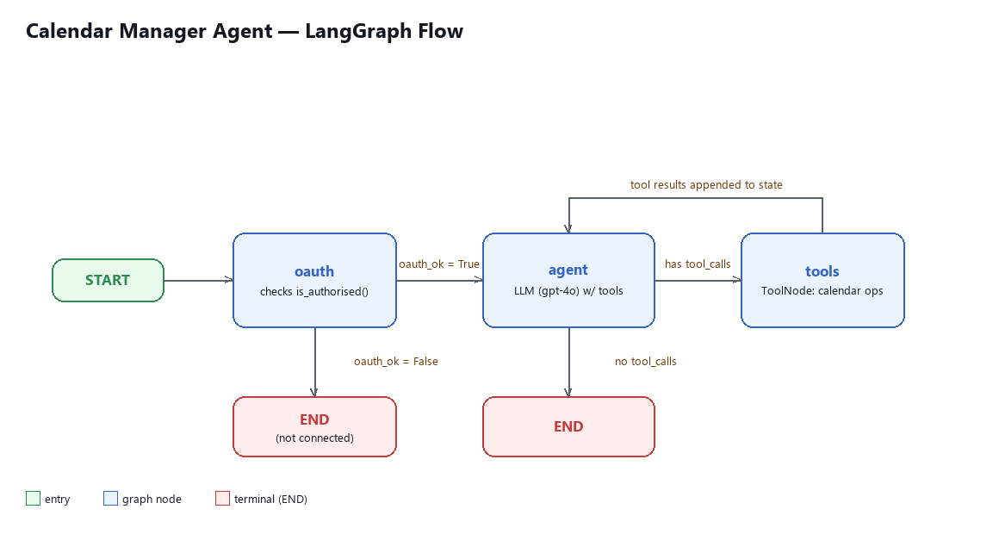

# Calendar Manager Agent

A Telegram bot that manages your Google Calendar through natural conversation, powered by a [LangGraph](https://github.com/langchain-ai/langgraph) agent and GPT-4o.

Ask it things like *"what's on my schedule this week?"*, *"move my dentist appointment to Thursday at 2pm"*, or *"when am I free for a 2-hour block?"* — it reads and writes directly to your Google Calendar.

## Features

- 📅 View events by date range or keyword search across all calendars
- ➕ Create events, including recurring ones, with attendees and reminders
- ✏️ Update or reschedule existing events
- 🗑️ Delete events (with confirmation)
- 🔍 Find free time slots across one or more calendars
- ✅ RSVP (accept / decline / tentative) to invites
- 🔐 Per-user Google OAuth via Device Authorization Flow (no local redirect server needed)

## Architecture

The bot ([bot.py](bot.py)) receives Telegram messages and hands each one to a LangGraph agent ([agent.py](agent.py)), which decides whether to call a Google Calendar tool ([tools.py](tools.py)) before replying. Each Telegram user has independent OAuth credentials, stored under `tokens/`.

### LangGraph flow



1. **oauth** — checks whether the requesting user has valid Google credentials
   - not connected → the graph ends and the bot prompts the user to run `/connect`
2. **agent** — GPT-4o, given the conversation history and a system prompt describing each tool, either replies directly or emits tool calls
3. **tools** — executes the requested calendar operation(s) and appends the results to the conversation; control returns to **agent** so it can use the results to form a reply
4. Loop continues until the agent responds with no further tool calls, then the graph ends

## Setup

### 1. Prerequisites

- Python 3.11+
- A [Google Cloud project](https://console.cloud.google.com/) with the Calendar API enabled and OAuth credentials (Desktop app type) downloaded as `credentials.json`
- A [Telegram bot token](https://core.telegram.org/bots#how-do-i-create-a-bot) from @BotFather
- An OpenAI API key

### 2. Install dependencies

```bash
python -m venv venv
venv\Scripts\activate        # Windows
pip install -r requirements.txt
```

### 3. Configure environment

Create a `.env` file in the project root:

```
TELEGRAM_TOKEN=your-telegram-bot-token
OPENAI_API_KEY=your-openai-api-key
```

Place your downloaded OAuth client file at `credentials.json` in the project root.

### 4. Run the bot

```bash
python bot.py
```

### 5. Connect your calendar

In Telegram, message the bot and send `/connect`. You'll get a short code to enter at a Google verification URL — no need to be on the same device as the bot.

## Bot commands

| Command    | Description                          |
|------------|---------------------------------------|
| `/start`   | Greeting and onboarding               |
| `/connect` | Link your Google Calendar             |
| `/status`  | Check connection status               |
| `/clear`   | Reset conversation history            |
| `/help`    | List example prompts and commands     |

## Project structure

```
agent.py          LangGraph agent: state, nodes, edges, system prompt
bot.py             Telegram bot: command handlers, message routing, formatting
calendar_auth.py   Google OAuth device flow, per-user credential storage
tools.py           LangChain tools wrapping the Google Calendar API
credentials.json   Google OAuth client config (not committed)
tokens/            Per-user pickled credentials (not committed)
```
